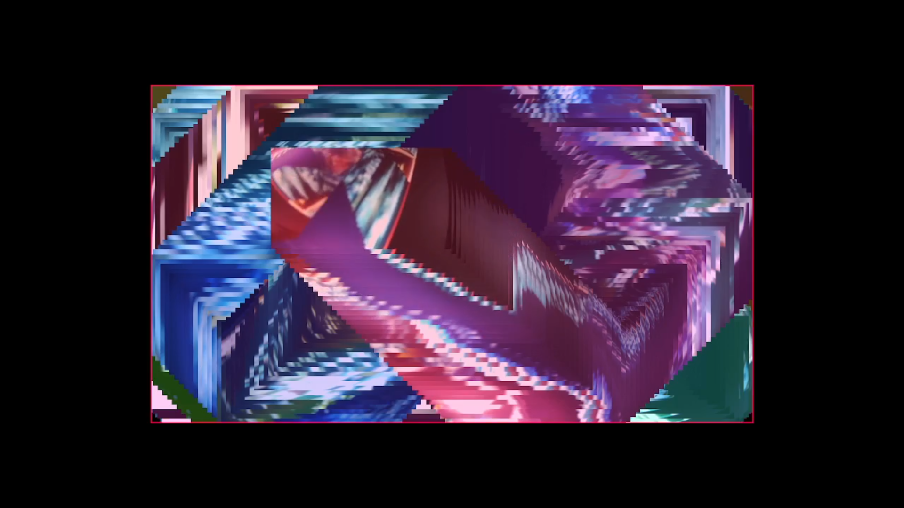

# CoolCam
Random Cool Virtual Camera Stuff

As of now, all the source code is very messy, and was made specficially to work on my hardware. Nothing here is reliable, you're on your own.

## DVD Feedback Loop


In order to setup the virtual camera, source `setup.sh`:
```
> source setup.sh
```

`regretsdvd.py` and `regretsdvd2.py` both initiate the cameras but with a 10 second delay at the start due to the specific use I had for them. How are they different? regeretsdvd.py sends 1 blank black frame, waits for 10 seconds, starts, and regeretsdvd2.py streams continously a black screen for 10 seconds.

Before running the scripts, you may have to play with the camera ids at the top of the scripts. You may notice there are two video captures - the script shows only one of them so simply repeat your camera id twice.

To view what video devices are avialabe for you:
```
v4l2-ctl --list-devices
```

TL;DR read the code if you want to use it
